## 第一部分 软件工程概论

**程序和软件的区别**

> 1. 软件是指在计算机系统的支持下，能够完成特定功能的程序、数据和相关文档（程序+数据+文档）
> 2. 程序是一组计算机能够识别和执行的指令
>
> 区别是软件是程序、数据和文档共同组成，而程序仅仅是计算机可识别的指令。

**软件的生存周期**

> ​	是：软件从提出开发开始到最终灭亡所经历的时期。从提出开发开始到开发出系统、运行维护以及最终退役的全过程。
>
> ​	不同的阶段有不同的软件制品
>
> | 需求分析 | 软件设计 | 编码实现 | 软件测试 | 部署运行 |
> | -------- | -------- | -------- | -------- | -------- |

**何为软件工程**

> 将**系统的**、**规范的**、**可量化**的方法应用于软件的开发、运行和维护的过程；
>
> 过程+方法学+工具
>
> 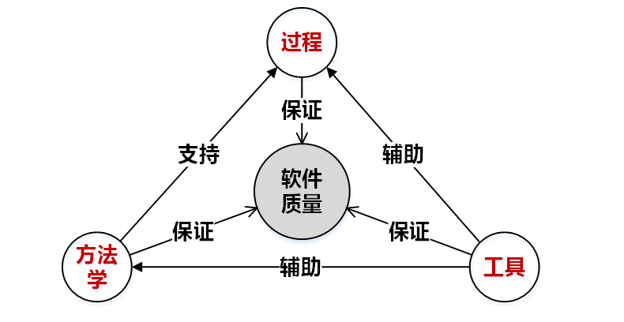

## 第二部分 软件过程和开发方法

**软件过程模型** (important)

> 
>
> | 模型名称 | 指导思想                                 | 关注点                             | 适合软件（重点关注）                       | 管理难度 | 不足             |
> | -------- | ---------------------------------------- | ---------------------------------- | ------------------------------------------ | -------- | ---------------- |
> | 瀑布模型 | 提供系统性指导                           | 与软件生命周期相一致               | 需求变化不大，较为明确，可预先定义的应用   | 简单     | 需求确定，交付慢 |
> | 增量模型 | 快速交付、并行开发                       | 软件设计、编码、测试增量式完成     | 需求变化不大，较为明确，可预先定义的应用   | 简单     | 需求确定         |
> | 原型模型 | 以原型为媒介指导用户的需求导出和评价     | 支持用户参与到软件开发中、需求获取 | 理解需求难以表述清楚、不易导出和获取的应用 | 简单     |                  |
> | 螺旋模型 | 集成迭代模型和原型模型，**引入风险分析** | 计划指定和实施风险管理             | 开发风险大，需求难以确定                   | 难       | 管理难度大       |
> | 迭代模型 | 多次迭代，每次都明确软件需求             | 分多次迭代来开发软件               | 需求变动大，难以一次说清楚                 | 中等     | 迭代次数不确定   |
>
> 问：增量过程和迭代过程区别？
>
> 增量过程可以并行，而迭代过程每次都明确软件需求

**敏捷方法/群体化方法**（了解）

> 敏捷方法：
>
> ​	是什么？
>
> > 1. 一种轻量级的软件开发方法
> > 2. 开发时以代码为中心，不以文档为中心，快速轻巧应对需求变化
>
> ​	特点?
>
> > 1. 强化可运行的软件，弱化文档
> > 2. 以适应变化为目的推进开发
> > 3. 以人为本
>
> 群体化开发（开源项目）：
>
> ​	是什么？
>
> > ​	是依托互联网平台来吸引组织互联网上的大规模软件开发人员，通过竞争、合作等方式，让他们参与软件开发、分享软件开发知识的一种新颖软件开发方法

## 第三部分 需求工程

**软件需求的类别**（important）

> 功能性需求：功能需求描述了软件能做什么、具有什么功能、可提供什么样的服务
>
> 非功能性需求（质量方面的需求）：外部质量属性，外部可展现的，用户、客户等会非常关心，如运行性能、可靠性、易用性等。内部质量属性，隐藏在内部的，软件开发工程师会非常关心，如可扩展性、可维护性、可理解性
>
> 约束性需求：开发成本、交付进度、技术选型

**用例图**（必考）

> 定义：是执行者与系统之间的业务交互动作的序列
>
> 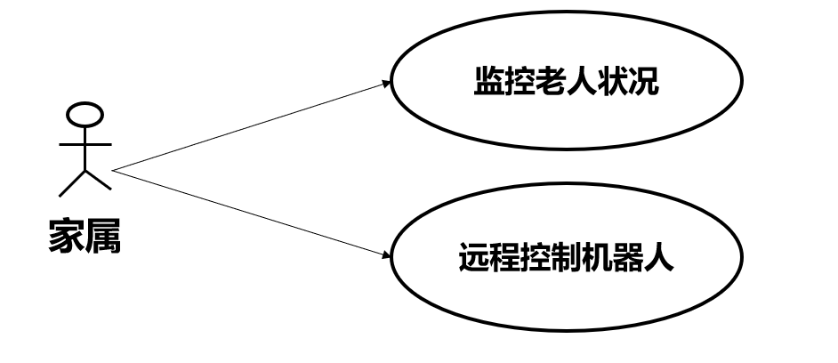
>
> 用例之间关系：
>
>    	1. 包含 A包含B A->B
>    	2. 扩展  A是B的扩展 A->B
>    	3. 继承 A是B的继承 A->B
>
> 实例：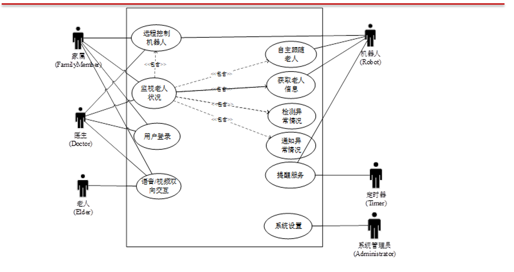

**交互图/类图/状态图**

> UML提供用例图分析**用例视角**的软件需求模型
>
> UML提供交互图、状态图描述**行为视角**的软件需求模型
>
> UML提供类图来描述**业务领域**的概念模型
>
> | 视角 | 图     | 说明                       |
> | ---- | ------ | -------------------------- |
> | 结构 | 类图   | 从类层面描述系统的静态结构 |
> | 行为 | 状态图 | 描述状态的变迁             |
> | 用例 | 用例图 | 从外部用户角度描述系统功能 |
> 
>交互图分为两类，一是顺序图，二是通信图
> 
>**顺序图**（考）
> 
>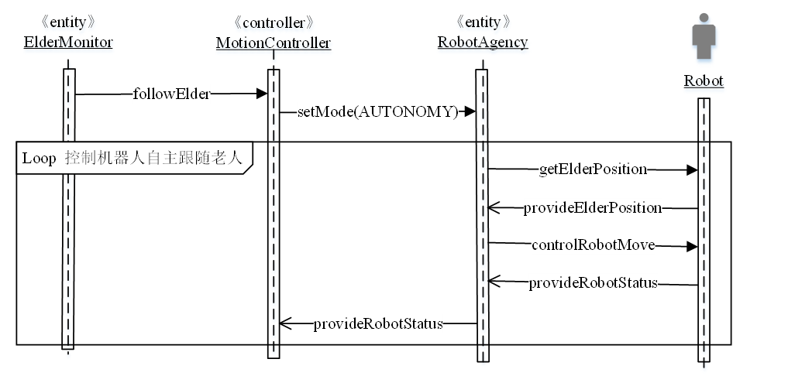
> 
>类图之间的关系（考）
> 
>- 关联：表示逻辑联系，可以是实例对象和类的连接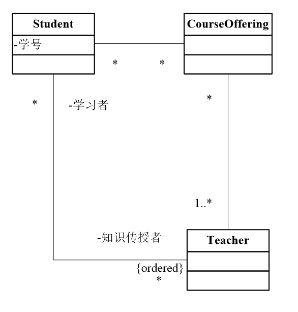
> - 依赖：一个类对象变化会导致另一个对象修改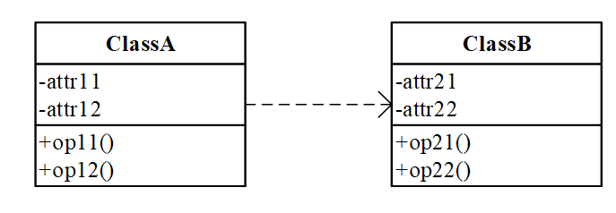
> - 继承：同oop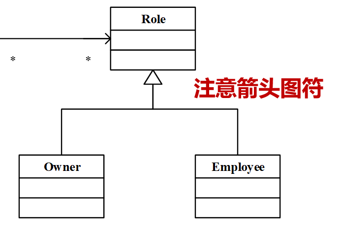
> - 实现：一个类实现另一个类的接口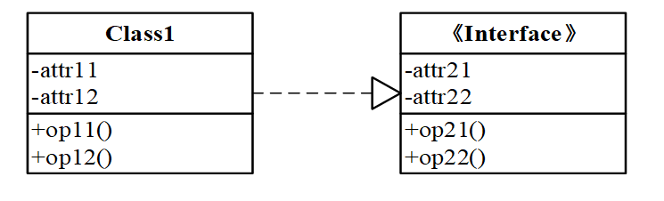
> - 聚合：部分类对象是多个整体类对象的组成
> - 组合：部分类对象只能位于一个整体类对象中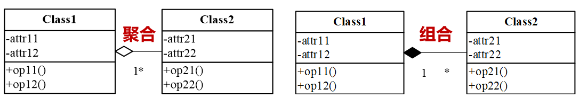
> 
>**状态图**(不重要)
> 
>动作在迁移边上
> 
>活动在点上
> 
>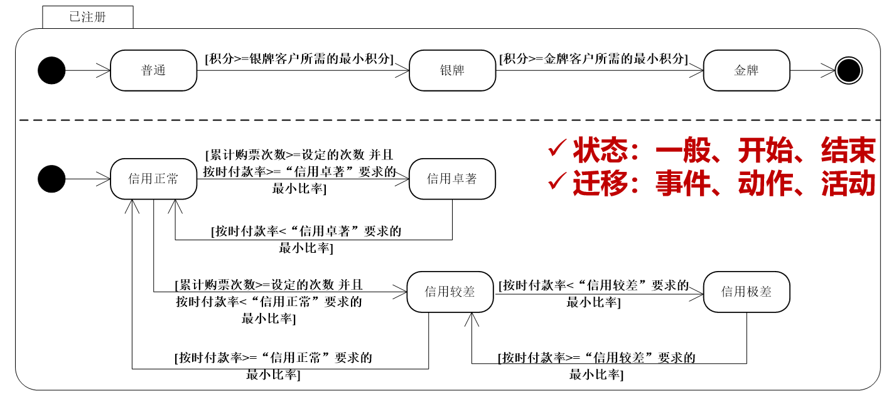

## 第四部分 软件设计

**软件设计基本原则**（背）

> 1. 抽象与逐步求精
> 2. 模块化，高内聚，低耦合度。（重点）
>    内聚度是模块内各成分间彼此结合的紧密程度。耦合度是模块间的相关程度。偶然性内聚，功能性内聚。
> 3. 信息隐藏：模块应该设计得使其所含的信息对那些不需要这些信息的模块不可访问（了解）
> 4. 多视点和关注点分离：关注点是针对概念、任务和目标的某个部分或者侧面的聚焦。（了解）
>    设计师将若干性质不同的关注点分离开来，以便在适当的时间处理不同的关注点，随后将这些关注点整合起来，形成局部或者全局性的设计结果（了解）
> 5. 软件重用：尽可能地重用已有的软件资产来实现软件系统的功能，同时要确保所开发的软件系统易于为其他软件系统所重用

**软件体系结构的设计元素**

> 1. 构件：构成体系结构的基本功能部件
> 2. 连接件：组件之间的连接和交互关系
> 3. 约束：组件中的元素应满足的条件

**包图/构件图/部署图**（important）

> **包图** 
>
> 包图可以刻画包间的构成和依赖关系
>
> 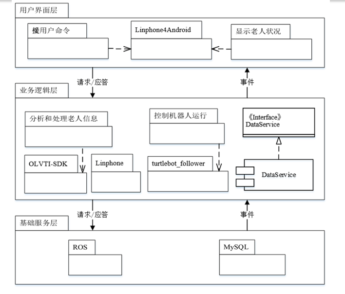
>
> **构件图**（不考）
>
> 结点：构件、类和包
>
> 关系：构成关系、依赖关系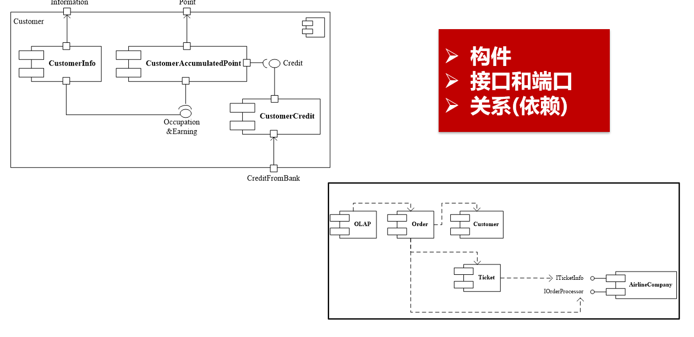
>
> **部署图**
>
> 节点：计算节点、工件、构件。节点是软件运行环境中的一组计算资源
>
> 边：通信和依赖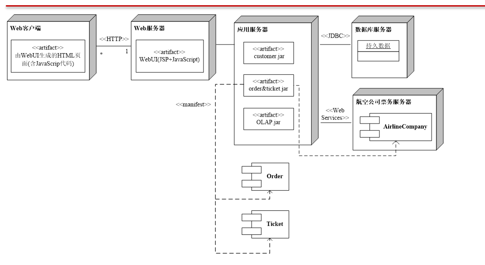

**软件体系结构风格**（必考）

> **分层风格**
>
> - 模型思想：将软件系统按照抽象级别逐次递减或者递增
> - 示例
>   - 顶层：面向用户的ui界面
>   - 底层：负责提供基础性、公共性的技术服务
>   - 中间层：介于二者之间，负责具体的业务处理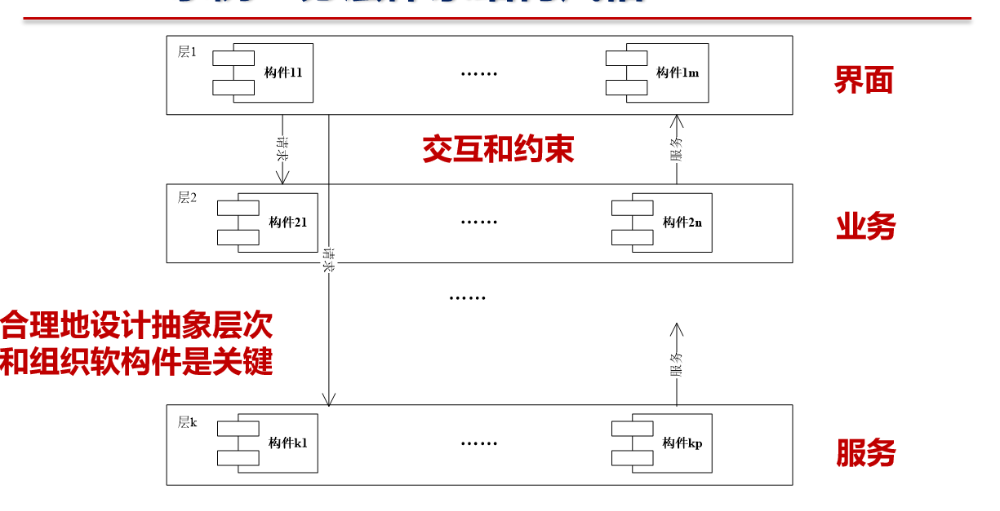
>
> **管道与过滤器风格**
>
> 构件：将软件功能实现为一系列的处理步骤，每个步骤封装到一个过滤器构件中
>
> 连接子：相邻过滤器间以管道作为连接
>
> 数据：软件系统的输入由数据源提供，输出由管道留向数据汇
>
> 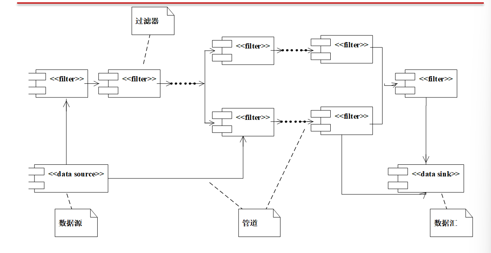
>
> 编译器是一个例子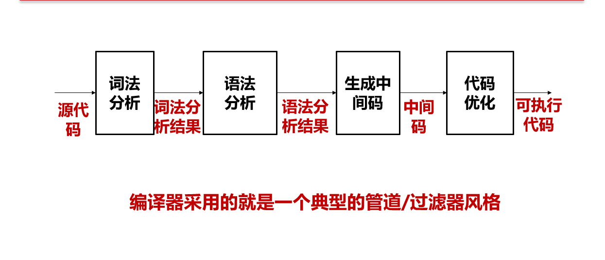
>
> 特点：可以自然的解决具有数据流特征的软件需求
>
> **黑板模板**
>
> 黑板：负责保存问题求解过程的状态数据，提供读写服务
>
> 知识源：负责根据黑板中的问题求解状态，进行部分问题求解工作
>
> 控制器：负责监视黑板中不断更新的状态数据，安排知识源活动
>
> 特点：
>
> - 可灵活升级和更换知识源构件
> - 知识源的独立性和重用性好
>
> **MVC风格**
>
> 模型构件：负责储存业务数据并提供业务逻辑处理
>
> 视图构件：负责向用户呈现模型的数据
>
> 控制器：选择适当的视图作为系统对用户界面动作的相应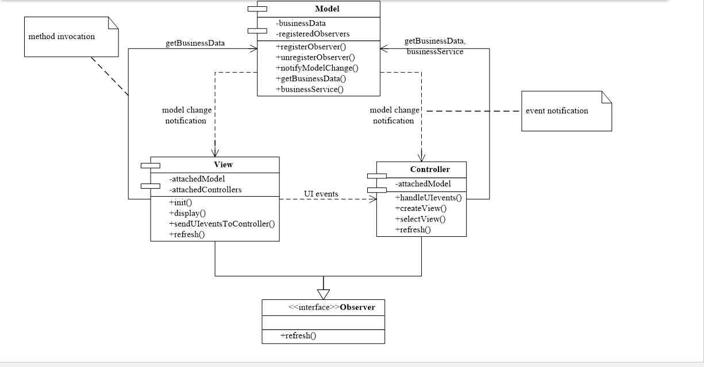

**区别**

| 类别           | 特点                                                         | 应用                                            |
| -------------- | ------------------------------------------------------------ | ----------------------------------------------- |
| 分层风格       | 分层抽象、层次间耦合度低、层次的功能可重用和可替换           | 绝大部分的应用软件                              |
| 管道过滤器风格 | 数据驱动的分级处理，处理流程可灵活重组，过滤器可重用         | 数据驱动的事务处理软件，如编译器、Web服务请求等 |
| MVC风格        | 模型、处理和显示的职责明确，构件间的关系局部化，各个软构件可重用 | 单机软件系统，Web应用软件系统                   |
| SOA风格        | 以服务作为基本的构件，支持异构构件之间的互操作，服务的灵活重用和组装 | 部署和运行在云平台上的软件系统                  |
| 消息总线风格   | 提供统一的消息总线，支持异构构件之间的消息传递和处理         | 异构构件之间消息通信密集型的软件系统            |

## 第五部分 软件测试

> 目的：
>
> - **测试**发现缺陷
> - **调试**定位缺陷
> - **排错**纠正错误
>
> 测试由独立的测试小组进行，调试和排错由开发人员完成

**单元测试**

> 测试对象：对软件基本模块单元进行测试
>
> 测试方法：大多采用白盒测试技术
>
> 测试内容：
>
> - 模块接口测试
> - 模块局部数据测试
> - 模块独立执行路径测试

**集成测试**

> 测试对象：对软件模块之间的接口进行测试
>
> 测试技术：采用黑盒测试技术
>
> 测试内容：
>
> - 过程调用
> - 函数调用
> - 消息传递

**确认测试**

> 测试对象：对软件的功能和性能进行测试
>
> 依据和标准：软件需求规格说明书
>
> 测试技术：采用黑盒测试技术

### 白盒测试(必考)

> - 遵循覆盖原则
> - 测试用例覆盖准则
>   - 语句覆盖：**是设计足够的测试用例，使得被测程序中每条语句至少执行一次**
>   - 分支覆盖（判定覆盖）：设计足够的测试用例**，使得程序中每个判定语句的取真和取假分支**至少被执行一次。
>   - 条件覆盖：**设计足够的测试用例**，使判定语句中的**每个逻辑条件取真值与取假值至少出现一次**。
>   - 基本路径覆盖：**设计足够的测试用例**，使得程序中的**每一条可能组合的路径都至少执行一次**。
>
> 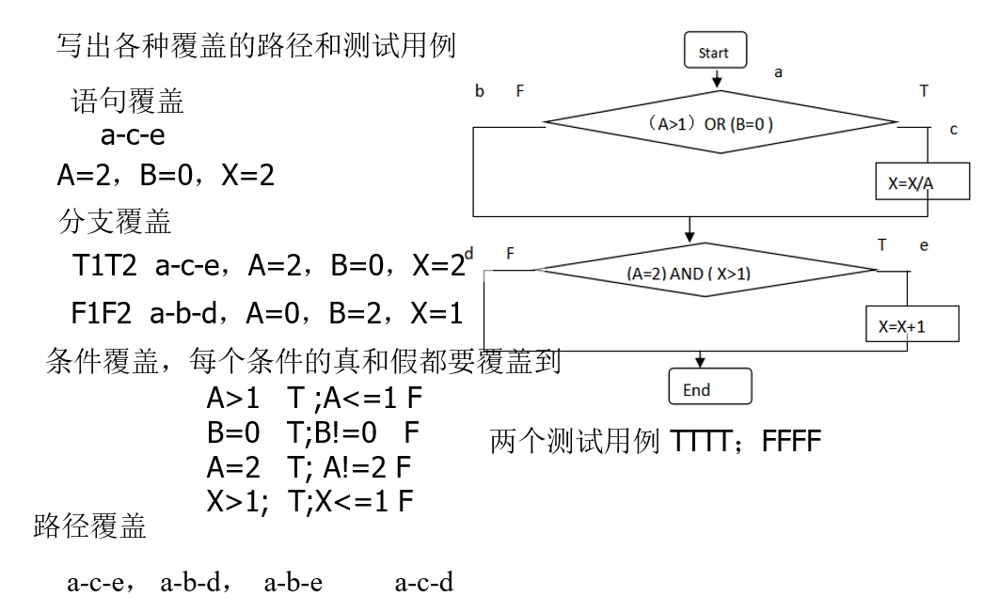

### 黑盒测试（必考）

> - 把程序的输入数据集合按输入条件划分为若干个等价类
>
> - 每一个等价类对于输入条件而言为一组有效或无效的输入
>
> - 举例
>
>   - 输入条件为一范围
>     - 划分出三个等价类
>     - (1) 有效等价类(在范围内)    (2)大于输入最大值    (3)小于输入最少值
>   - 输入条件为一值
>     - 划分为三个等价类
>     - (1)有效   (2)大于   (3)小于
>   - 输入条件为集合
>     - 划分二个等价类
>     - (1)有效(在集合内)     (2) 无效(在集合外)
>   - 输入条件为一个布尔量
>     - 划分二个等价类
>     - (1) 有效(此布尔量)    (2)无效(布尔量的非)
>
> - 示例
>
>   - z = fun(x,y)：当0<x<1024且y=0，z=-1，否则z = x*lg(y)
>
>   - 关于x的等价类：(0,1024)    (-∞，0]    (1024,+∞)
>
>   - 关于y的等价类：{0}    (-∞，0）(0,+∞);
>
>     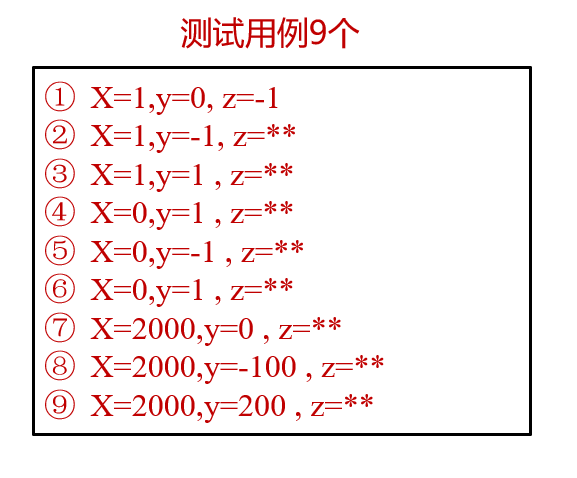

**软件维护**（背诵）

> *纠正性维护*
>
> - 定义：纠正软件中的**缺陷**和**错误**
> - 起因：用户在使用软件过程中一旦发现缺陷，他们会向开发人员提出纠正性维护的请求
> - 目的：诊断和改正软件系统中潜藏的缺陷
>
> *适应性维护*
>
> - 定义：对软件进行**改造**以便适应**新的运行环境和平台**
> - 起因：软件运行于一定的环境(硬件、OS、网络等)之上，运行环境发展很快，出现了变化
> - 目的：适应环境变化和发展而对软件进行维护
>
> *改善性维护*
>
> - 定义：对软件进行改造以**增加新的功能、修改已有的功能**
> - 起因：在软件系统运行期间，用户可能要求增加新的功能、建议修改已有功能或提出其他改进意见
> - 目的：满足用户日益增长的各种需求而对软件系统进行的改善和补充
>
> *预防性维护*
>
> - 定义：对软件结构进行改造以便**提高软件的可靠性和可维护性等**
> - 起因：为进一步改善软件系统的可维护性和可靠性，为以后的软件改进奠定基础的维护活动
> - 目的：获取软件结构，重新改善软件结构

